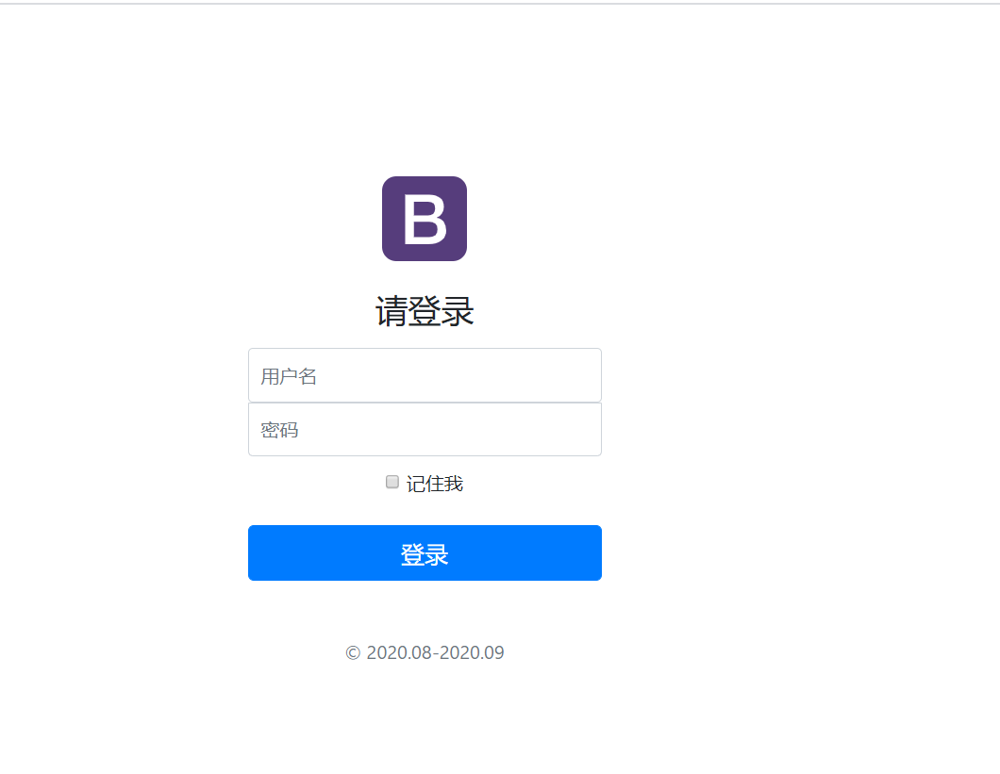
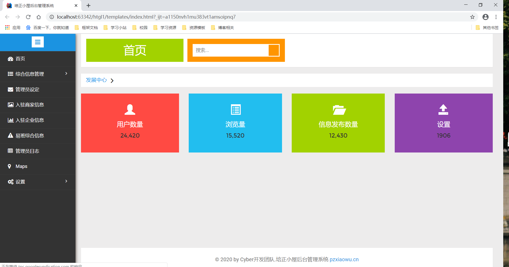
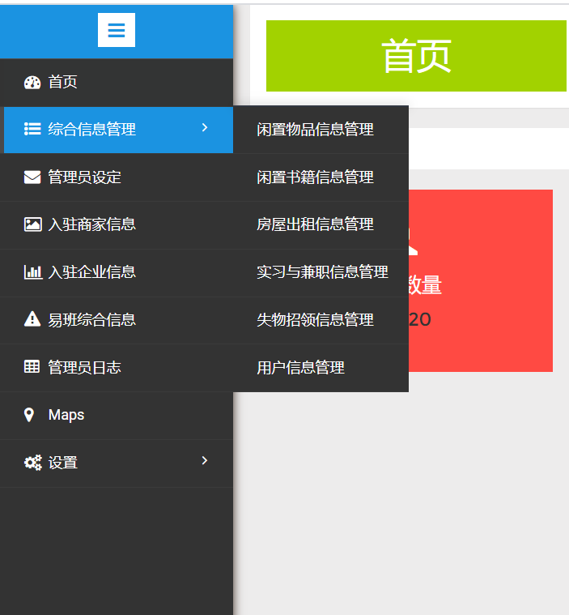
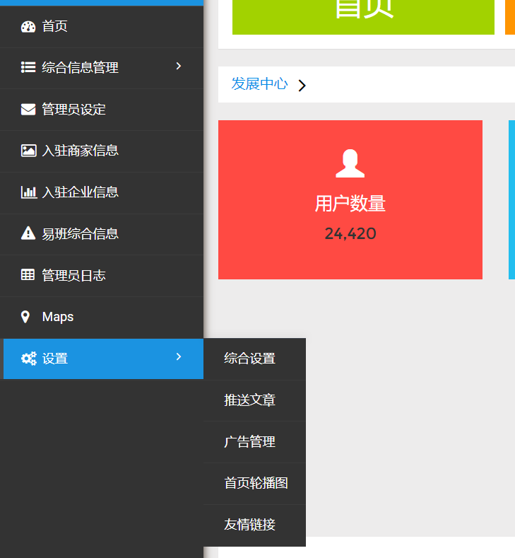
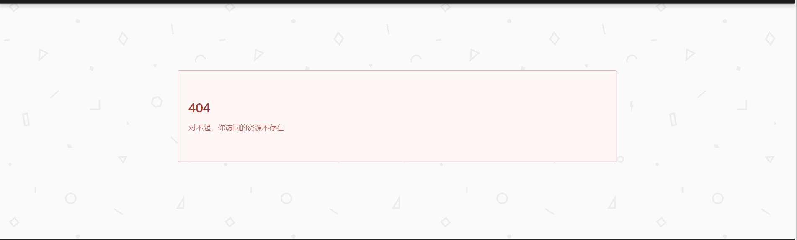
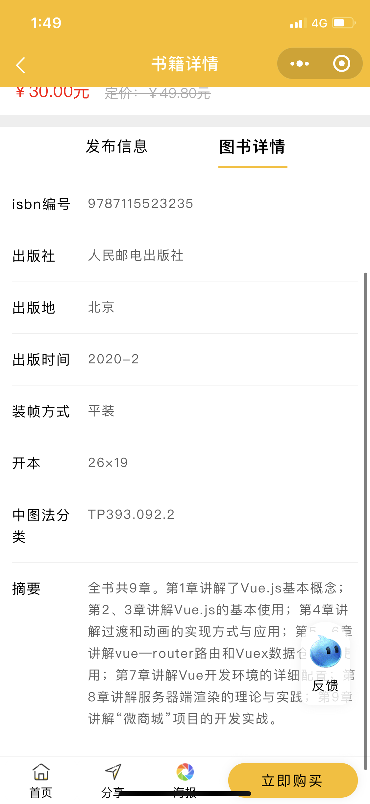
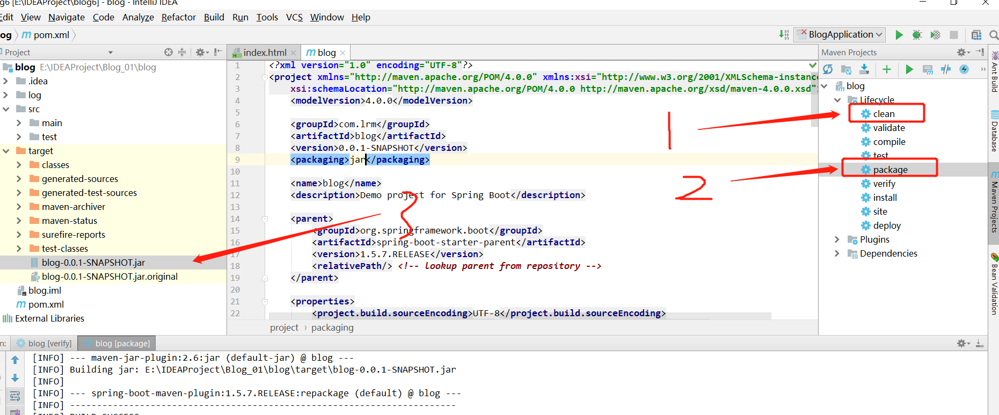
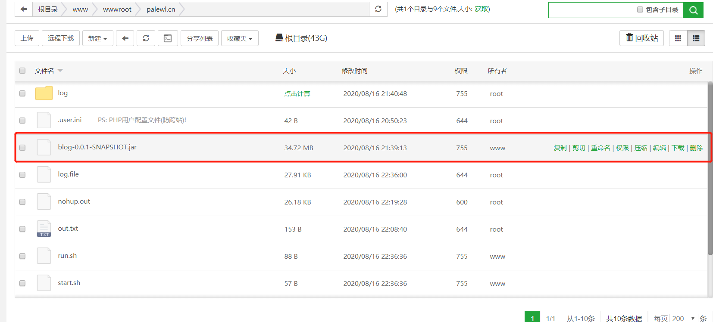

## 引言

本项目旨在开发一款适用于高校学生，具有数字化和信息化、交易信息公开化和透明化的智慧校园程序，建立统一的校园二手交易平台能够规范校园内的二手交易市场制度，健全完善的制度和人性化的分类商品，引导商户在校园内正确的交易导向，促进闲置物品的合理运用，促进这种资源合理再运用的思和资源可持续利用的发展思想在学生群众中蔓延，为校内有购买或者出售二手闲置物品的同学提供一个安全，便捷，高效的信息发布，信息共享平台

## 问题定义


~~~java
	随着社会的不断发展，人们的消费能力有了显著的提高，而作为大学生这一特殊的消费群体，在互联网电商时代有着居高不下的消费能力，在众多的消费当中，自然而然的产生了众多闲置物品。以广东培正学院为例，二手商品的需求正处于稳步上升的阶段，闲置物品往往比新品价格更低，优惠更多，购买闲置物品的思想观念已经获得了较高的认可，但由于没有统一的资源平台，许多大学生往往通过添加微信群、贴吧等软件来寻找闲置资源，闲置物品的交易信息不流通，微信群交易人员鱼龙混杂，闲置物品种类繁多杂乱，无法给大学生这一群体提供良好的交易环境。
        
	其二，目前市面上的一些闲置平台，很少有关注大学生这一特定群体的平台，特别是在一些特殊的季节和时期，如大学毕业季时，就会产生许许多多的闲置物品，但缺乏平台及学校的正确引导，部分回收物品的人员对二手闲置物品的回收价格极度不合理，定价完全在对方手里，许多物品往往都会被丢弃，造成资源的浪费。又如在高校中的，如果学校采取自愿订书的原则的话，出于闲置物品的价格更低、书籍自身的重复使用性，往往每个学期都会有大量的学生自己去寻找闲置书籍，而此时因为书籍的类别繁多、杂乱，学生们无法正确判断，针对这种高校特定的时期，缺乏统一平台，学生们寻找合适的闲置书籍愈发困难。

       
~~~


## 搭建思路


​	搭建思路：采用前后端分离的开发机制，分工合作，利用微信平台小程序免安装、跨平台的特性，设计一个便捷的校园二手交易小程序，后端采用Java为技术栈，以Springboot作为脚手架作为逻辑层和视图层的开发框架，持久层以SpringData Jpa作为开发的技术点，前台页面渲染采用thymeleaf作为模板引擎，数据库版本为MySQL5.5


## 需求分析


## 开发样式













## 数据库关系

**发布闲置物品实体类参数 items：**

~~~mysql
序号：id

标题：title 

内容：content 

上传图片的链接：picture[] 

联系人昵称：nickname 

联系方式：telephone  

售卖价格：price 


创建时间：create_Time

更新时间: update_Time

type：手机数码、女生用品、闲置书籍   
~~~


**发布二手书物品实体类参数 items_book：**

~~~jvaa
序号：id

标题：title

摘要：content(简单描述内容及联系方式)

上传图片的链接：picture[]

出版社：publisher 

联系人昵称：nickname

联系方式：telephone

创建时间：create_Time

更新时间: update_Time

售卖价格：price
~~~





**发布闲置物品实体类参数 item_rent：**

~~~java
序号：id

标题：title 

内容：content 

上传图片的链接：picture[] 

联系人昵称：nickname 

联系方式：telephone  

售卖价格：price 

创建时间：create_Time

更新时间: update_Time


~~~


**用户实体类 user** 

~~~java
序号id

用户名 username

用户密码 password

昵称：nickname

头像地址：avatar

创建时间：create_Time

更新时间: update_Time

联系电话：phone

~~~

**闲置物品实体类 Type**

用于表达有哪些类别的：数码产品、个人用品、闲置书籍等

~~~java
序号 id
类别 name
~~~

**闲置书籍实体类**tag 

用户表达书籍的类别：新书、二手书

~~~mysql
序号 id
类别 name
~~~

**房屋出租实体类 rent**

房屋出租的类别：个人房源、中介房源

~~~java
序号 id
类别 name
~~~


## 后台功能需求

### 需求说明

​		此后台网站应满足对小程序日常的管理机制、学生的身份认证管理机制以及小程序的数据管理，主要功能模块如下：

*  404、500的错误页面友好提示信息
* 登录模块 ：分为普通管理员和超级管理员，登录界面友好提示，记住账号等
* 分类信息的管理，后台网站应能够友好的管理分类信息情况
* 分类查询的管理，根据小程序用户分类的信息发布情况来分别查询对应的发布信息
* 超级管理员：超级管理员可以增设新的管理员，账户密码以及相应的权限
* 小程序轮播图：后台管理网站应要有相应的轮播图上传，控制小程序的推广信息
* 管理员个人中心：管理员的个人中心应满足 昵称、图片、密码的修改需求

### 1.环境搭建

版本控制器: git

技术栈：

 * SpringBoot +SpringbootData JPA组合开发
 * MySQL 5.7
 *  创建Maven工程
 * 前端使用H55+   JQuery+VUE  /boostrap/Semantic-UI组合开发

### 2.登录功能及管理员设置

* 完成登录页面的设计
* 完成用户登录操作
* 使用MD5加密模式
* 使用网页拦截器
* 管理员查询列表
* 管理员的增删改查

### 3.闲置物品信息管理

​	分页查询---查询、删除

### 4.闲置书籍信息管理

​	分页查询---查询、删除

### 5.房屋出租信息管理

​	分页查询---查询、删除

## 命名约定

**Service/DAO层命名约定：**

- 获取单个对象的方法用get做前缀。  
- 获取多个对象的方法用list做前缀。
- 获取统计值的方法用count做前缀。  
- 插入的方法用save(推荐)或insert做前缀。
- 删除的方法用remove(推荐)或delete做前缀。
- 修改的方法用update做前缀。

## 进度计划


|  时间(月份)  |   完成内容   | 完成情况 |
| :----------: | :----------: | :------: |
|  9.25-12.01  |   项目开发   |          |
|    12.01     |   项目完成   |          |
| 12.01- 12.10 | 项目综合测试 |          |

## 人员安排


| 前后端分离 | 开发人员 | 开发任务 | 备注 |
| :--------: | :------: | :------: | :--: |
|            |          |          |      |
|            |          |          |      |

部署前期教程：


## 项目部署

部署前期教程：[傻瓜式操作-如何将网页部署上线](https://palewl.cn/blog/13;jsessionid=166C0D2D66B229AF9DC90050CF77F0D1)

1. 将项目进行打包成jar包 


2. 将该jar包放入服务器任意文件

   

3. 为了保持运行，需要将三个脚本也放入。

   查看端口号情况：

   ``` java
   netstat -lnp | grep 80
   ```

   

4. 如遇到权限问题，需要加上以下代码：

   ~~~java
   
   1.定位到jar包的目录
   cd /www/wwwroot/palewl.cn
   2.获取操作的权限
   chmod u+x *.sh
   3.执行命令①或②
   ①：
   nohup java -jar blog-0.0.1-SNAPSHOT.jar --server.port=80 &
   nohup java -jar qcl443.jar --server.port=443 &
   nohup java -jar htgl-0.0.1-SNAPSHOT.jar
   nohup  java -jar blog-0.0.1-SNAPSHOT.jar
   ②：./run.sh
   4.打印输出
   5. 此时即可保持运行
   ~~~


